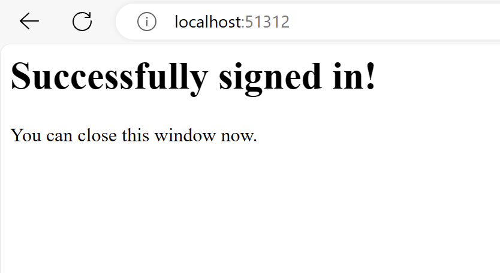

# Installation

1. Install Module

   ```sh
   cd ~/MagicMirror/modules
   git clone https://github.com/hermanho/MMM-OneDrive
   cd MMM-OneDrive
   npm run install-prod
   ```

   If you are using Docker

   ```sh
   cd ~/MagicMirror/modules
   git clone https://github.com/hermanho/MMM-OneDrive
   docker exec -it -w /opt/magic_mirror/module MMM-OneDrive magic_mirror npm run install-prod
   ```

1. Add MMM-OneDrive module config in ~/MagicMirror/config/config.js

## Authorise OAuth Token

### On-device (Just do it on Raspberry PI with Desktop UI)

   1. Start MagicMirror as usual

      ```sh
      cd ~/MagicMirror
      npm start
      ```

   1. At first execution, It will open a browser and will ask you to login Microsoft account.
   1. Authorize it and close the browser when done
      <br />
      
      <br />
      

### Sperated machine (When the device does not have Desktop UI)

   1. Install a copy in your local machine (Win / Mac)
   1. Start MagicMirror as usual

      ```sh
      cd ~/MagicMirror
      npm start
      ```

   1. At first execution, It will open a browser and will ask you to login Microsoft account.
   1. Authorize it and close the browser when done
      <br />
      
      <br />
      
      
   1. Copy the file `msal/token.json` to the folder `MMM-OneDrive` in the remote device
