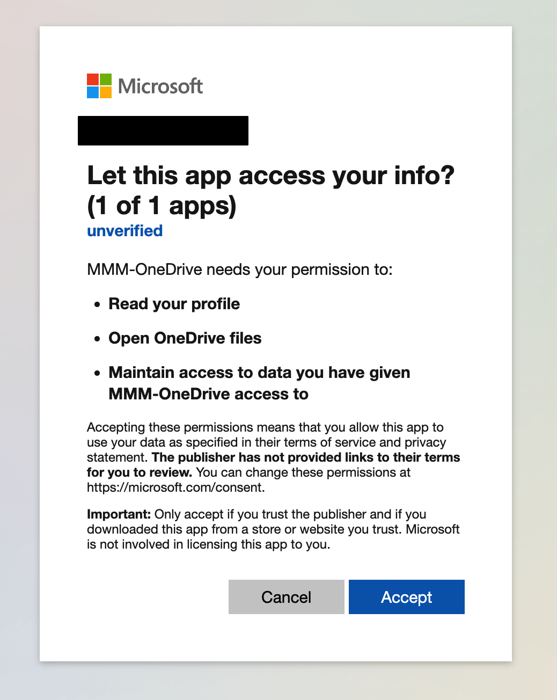

## Installation
1. Install Module
```sh
git clone https://github.com/hermanho/MMM-OneDrive.git
cd MMM-OneDrive
npm install
```

If you doubt errors are caused by different `node.JS` version, you can try to compile it by yourself.
In that case, you need to rebuild some binaries to match with Electron version.
```sh
cd ~/MagicMirror/modules/MMM-OneDrive
npm install --save-dev electron-rebuild
./node_modules/.bin/electron-rebuild   # It could takes dozens sec.
```

2. If you are using Docker
```sh
cd ~/magic_mirror/modules
git clone https://github.com/hermanho/MMM-OneDrive.git
docker exec -it -w /opt/magic_mirror/modules/MMM-OneDrive magic_mirror npm install
```

### Authorise OAuth Token

1. Clone this repo in your local pc and execute `npm install`
2. At first execution, It will open a browser and will ask you to login google account and to consent your allowance.
3. Authorize it and close the browser   
   
4. Copy the file `msal/token.json` to the folder `MMM-OneDrive` in the remote device
